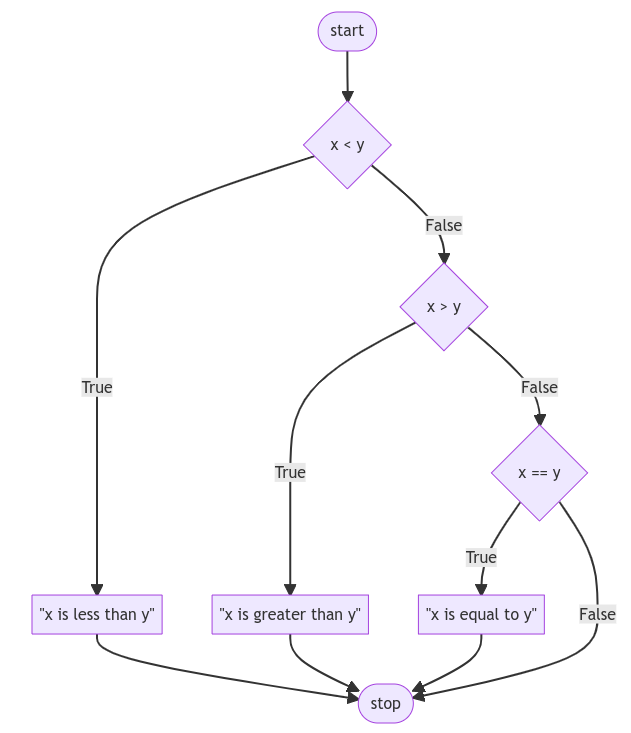

# Lecture #01.1 - Conditionals - Notes

## Summary

You now have the power within Java to use conditional statements to ask questions and have your program take action accordingly. In this lecture, we will discuss…

- `if` Statements;
- Control flow;
- OR Operator `||`;
- AND Operator `&&`;
- Modulo;
- Creating your own function.

## Conditionals

- Conditionals allow you, the programmer, to allow your program to make decisions: As if your program has the choice between taking the left-hand road or the right-hand road based upon certain conditions.
- Built within Java are a set of “operators” that can are used to ask mathematical questions.
- `>` and `<` symbols are probably quite familiar to you.
- `>=` denotes “greater than or equal to.”
- `<=` denotes “less than or equal to.”
- `==` denotes “equals, though do notice the double equal sign! A single equal sign would assign a value. Double equal signs are used to compare variables.
- `!=` denotes “not equal to”.
- Conditional statements compare a left-hand term to a right-hand term.

## If Statements

- In your terminal window, type `code Compare.java`. This will create a brand new file called “Compare.java” in VS Code.
- In the text editor window, begin with the following:

    ```
    public class Compare {
        public static void main(String[] args) {
            Scanner sc = new Scanner(System.in);

            System.out.println("What's x? ");
            int x = sc.nextInt();

            System.out.println("What's y? ");
            int y = sc.nextInt();

            sc.close();

            if (x < y) {
                System.out.print("x is less than y");
            }
        }
    }
    ```

  Notice how your program takes the input of the user for both x and y, casting them as integers and saving them into their respective x and y variables. Then, the `if` statement compares x and y. If the condition of `x < y` is met, the `print` statement is executed.

- `if` statements use `boolean` values (`true` or `false`) to decide whether or not to execute. If the statement of `x > y` is true, the compiler will register it as `true` and execute the code.

## Control Flow

- Further revise your code as follows:

    ```
    public class Compare {
        public static void main(String[] args) {
            Scanner sc = new Scanner(System.in);

            System.out.println("What's x? ");
            int x = sc.nextInt();

            System.out.println("What's y? ");
            int y = sc.nextInt();

            sc.close();

            if (x < y) {
                System.out.print("x is less than y");
            } else if (x > y) {
                System.out.print("x is greater than y");
            } else if (x == y) {
                System.out.print("x is equal to y");
            }
        }
    }
    ```

  Notice how you are providing a series of `if` statements. First, the first `if` statement is evaluated. Then, the second `if` statement runs its evaluation. Finally, the last `if` statement runs its evaluation. This flow of decisions is called “control flow.”

- Our code can be represented as follows:

  <div align="center">
    
  </div>
  </br>

- This program can be improved by not asking three consecutive questions. After all, not all three questions can have an outcome of true! Revise your program as follows:

    ```
    public class Compare {
        public static void main(String[] args) {
            Scanner sc = new Scanner(System.in);

            System.out.println("What's x? ");
            int x = sc.nextInt();

            System.out.println("What's y? ");
            int y = sc.nextInt();

            sc.close();

            if (x < y) {
                System.out.print("x is less than y");
            } else if (x > y) {
                System.out.print("x is greater than y");
            } else if (x == y) {
                System.out.print("x is equal to y");
            }
        }
    }
    ```

  Notice how the use of `else if` allows the program to make less decisions. First, the `if` statement is evaluated. If this statement is found to be true, all the `else if` statements not be run at all. However, if the `if` statement is evaluated and found to be false, the first `else if` will be evaluated. If this is true, it will not run the final evaluation.

- Our code can be represented as follows:

<div align="center">
  
</div>
</br>

- While your computer may not notice a difference speed-wise between our first program and this revised program, consider how an online server running billions or trillions of these types of calculations each day could definitely be impacted by such a small coding decision.
- There is one final improvement we can make to our program. Notice how logically `else if (x == y)` is not a necessary evaluation to run. After all, if logically x is not less than y AND x is not greater than y, x MUST equal y. Therefore, we don’t have to run `else if (x == y)`. We can create a “catch-all” default outcome using an `else` statement. We can revise as follows:

    ```
    public class Compare {
        public static void main(String[] args) {
            Scanner sc = new Scanner(System.in);

            System.out.println("What's x? ");
            int x = sc.nextInt();

            System.out.println("What's y? ");
            int y = sc.nextInt();

            sc.close();

            if (x < y) {
                System.out.print("x is less than y");
            } else if (x > y) {
                System.out.print("x is greater than y");
            } else {
                System.out.print("x is equal to y");
            }
        }
    }
    ```

  Notice how the relative complexity of this program has decreased through our revision.

- Our code can be represented as follows:

    <div align="center">
    
    </div>
    </br>

## OR Operator

- `or` allows your program to decide between one or more alternatives. For example, we could further edit our program as follows:

    ```
    public class Compare {
        public static void main(String[] args) {
            Scanner sc = new Scanner(System.in);

            System.out.println("What's x? ");
            int x = sc.nextInt();

            System.out.println("What's y? ");
            int y = sc.nextInt();

            sc.close();

            if ((x < y) || (x > y)) {
                System.out.print("x is not equal to y");
            } else {
                System.out.print("x is equal to y");
            }
        }
    }
    ```

  Notice that the result of our program is the same, but the complexity is decreased and the efficiency of our code is increased.

- At this point, our code is pretty great. However, could the design be further improved? We could further edit our code as follows:

    ```
    public class Compare {
        public static void main(String[] args) {
            Scanner sc = new Scanner(System.in);

            System.out.println("What's x? ");
            int x = sc.nextInt();

            System.out.println("What's y? ");
            int y = sc.nextInt();

            sc.close();

            if (x != y) {
                System.out.print("x is not equal to y");
            } else {
                System.out.print("x is equal to y");
            }
        }
    }
    ```

  Notice how we removed the `or` entirely, and simply asked “is x not equal to y?” We ask one and only one question. Very efficient!

- For the purpose of illustration, we could also change our code as follows:

    ```
    public class Compare {
        public static void main(String[] args) {
            Scanner sc = new Scanner(System.in);

            System.out.println("What's x? ");
            int x = sc.nextInt();

            System.out.println("What's y? ");
            int y = sc.nextInt();

            sc.close();

            if (x == y) {
                System.out.print("x is equal to y");
            } else {
                System.out.print("x is not equal to y");
            }
        }
    }
    ```

  Notice that the `==` operator evaluates if what is on the left and right are equal to one another. That use of double equal signs is very important. If you use only one equal sign, an error will likely be thrown by the compiler.

- Our code can be illustrated as follows:
    <div align="center">
    
    </div>
    </br>

## AND Operator

- Similar to `or`, `and` can be used within conditional statements.
- Execute in the terminal window `code Grade.java`. Start your new program as follows:

    ```
    public class Compare {
        public static void main(String[] args) {
            Scanner sc = new Scanner(System.in);

            System.out.println("Score: ");
            int score = sc.nextInt();

            sc.close();

            if ((score >= 90) && (score <= 100)) {
                System.out.print("Grade: A");
            } else if ((score >= 80) && (score <= 90)) {
                System.out.print("Grade: B");
            } else if ((score >= 70) && (score <= 80)) {
                System.out.print("Grade: C");
            } else if ((score >= 60) && (score <= 70)) {
                System.out.print("Grade: D");
            } else {
                System.out.print("Grade: E");
            }
        }
    }
    ```

  Notice that executing `Grade.java` you will be able to input a score and get a grade. However, notice how there are potentials for bugs.

- Still, we can further improve our program:

    ```
    public class Compare {
        public static void main(String[] args) {
            Scanner sc = new Scanner(System.in);

            System.out.println("Score: ");
            int score = sc.nextInt();

            sc.close();

            if (score >= 90) {
                System.out.print("Grade: A");
            } else if (score >= 80) {
                System.out.print("Grade: B");
            } else if (score >= 70) {
                System.out.print("Grade: C");
            } else if (score >= 60) {
                System.out.print("Grade: D");
            } else {
                System.out.print("Grade: E");
            }
        }
    }
    ```

  Notice how the program is improved by asking fewer questions. This makes our program easier to read and far more maintainable in the future.

## Modulo

- In mathematics, parity refers to whether a number is either even or odd.
- The modulo `%` operator in programming allows one to see if two numbers divide evenly or divide and have a remainder.
- For example, `4 % 2` would result in zero, because it evenly divides. However, `3 % 2` does not divide evenly and would result in a number other than zero!
- In the terminal window, create a new program by typing `code Parity.java`. In the text editor window, type your code as follows:

    ```
    public class Compare {
        public static void main(String[] args) {
            Scanner sc = new Scanner(System.in);

            System.out.println("What's x? ");
            int x = sc.nextInt();

            sc.close();

            if (x % 2 == 0) {
                System.out.print("Even");
            } else {
                System.out.print("Odd");
            }
        }
    }
    ```

  Notice how our users can type in any number 1 or greater to see if it is even or odd.

## Ternary Operator

* Alternatively, we can write the previous example using Ternary Operator.

    ```
    public class Compare {
        public static void main(String[] args) {
            Scanner sc = new Scanner(System.in);

            System.out.println("What's x? ");
            int x = sc.nextInt();

            sc.close();

            String value = (x % 2 == 0) ? "Even" : "Odd";

            System.out.print(value);
        }
    }
    ```

* Java ternary operator is the only conditional operator that takes three operands. It’s a one-liner replacement for the 'if-else' statement and is used a lot in Java programming. 
* Syntax:

    ```
    variable = condition ? returnedValueIfConditionIsTrue : returnedValueIfConditionIsFalse
    ```

## Creating Our Own Parity Function

- As discussed in [Lecture #01.0](../01_0_Functions_and_Variables/NOTES.md), you will find it useful to create a function of your own!
- We can create our own function to check whether a number is even or odd. Adjust your code as follows:

    ```
    public class Compare {
        public static void main(String[] args) {
            Scanner sc = new Scanner(System.in);

            System.out.println("What's x? ");
            int x = sc.nextInt();

            sc.close();

            if (isEven(x)) {
                System.out.print("Even");
            } else {
                System.out.print("Odd");
            }
        }

        public static boolean isEven(int n) {
            if (n % 2 == 0) {
                return true;
            } else {
                return false;
            }
        }
    }
    ```

  Notice that one reason our `if` statement `isEven(x)` works, even though there is no operator there. This is because our function returns a `boolean`, true or false, back to the main function. The `if` statement simply evaluates whether or not `isEven` of `x` is true or false.

## Switch/Case

- Similar to `if`, `else if` and `else` statements, `switch/case` statements can be used to conditionally run code that matches certain values.
- Consider the following program:

    ```
    public class Compare {
        public static void main(String[] args) {
            Scanner sc = new Scanner(System.in);

            System.out.println("What's your name? ");
            String name = sc.nextLine();

            sc.close();

            if (name.equals("Harry")) {
                System.out.println("Gryffindor");
            } else if (name.equals("Hermione")) {
                System.out.println("Gryffindor");
            } else if (name.equals("Ron")) {
                System.out.println("Gryffindor");
            } else if (name.equals("Draco")) {
                System.out.println("Slytherin");
            } else {
                System.out.println("Who?");
            }
        }
    }
    ```

  Notice the first three conditional statements print the same response.

- We can improve this code slightly with the use of the `or` operator:

    ```
    public class Compare {
        public static void main(String[] args) {
            Scanner sc = new Scanner(System.in);

            System.out.println("What's your name? ");
            String name = sc.nextLine();

            sc.close();

            if (name.equals("Harry") || name.equals("Hermione") || name.equals("Ron")) {
                System.out.println("Gryffindor");
            } else if (name.equals("Draco")) {
                System.out.println("Slytherin");
            } else {
                System.out.println("Who?");
            }
        }
    }
    ```

  Notice the number of `else if` statements has decreased, improving the readability of our code.

- Alternatively, we can use `switch/case` statements to map names to houses. Consider the following code:

    ```
    public class Compare {
        public static void main(String[] args) {
            Scanner sc = new Scanner(System.in);

            System.out.println("What's your name? ");
            String name = sc.nextLine();

            sc.close();

            switch (name) {
            case "Harry":
                System.out.println("Gryffindor");
                break;
            case "Hermione":
                System.out.println("Gryffindor");
                break;
            case "Ron":
                System.out.println("Gryffindor");
                break;
            case "Draco":
                System.out.println("Slytherin");
                break;
            default:
                System.out.println("Who?");
            }
        }
    }
    ```

  Notice the use of the `default` in the last case. This will match with any input, resulting in similar behavior as an `else` statement.

- A `switch/case` statement compares the value following the `switch` keyword with each of the values following the `case` keywords. In the event a match is found, the respective indented code section is executed and the program stops the matching.
- We can improve the code:

    ```
    public class Compare {
        public static void main(String[] args) {
            Scanner sc = new Scanner(System.in);

            System.out.println("What's your name? ");
            String name = sc.nextLine();

            sc.close();

            switch (name) {
            case "Harry":
            case "Hermione":
            case "Ron":
            case "Draco":
                System.out.println("Slytherin");
                break;
            default:
                System.out.println("Who?");
            }
        }
    }
    ```

  Much like the `||` operator, this allows us to check for multiple values in the same `case` statement.
