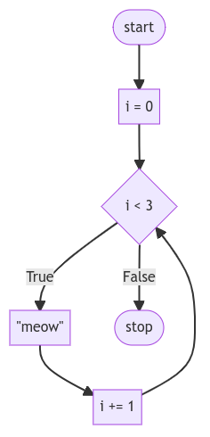

# Lecture #02 - Loops - Notes

## Summary

You now have another power in your growing list of your Java abilities. In this lecture we will address…

* while
* for
* List

## Loops

* Essentially, loops are a way to do something over and over again.
* Begin by typing `code Hello.java` in the terminal window.
* In the text editor, begin with the following code:

    ```
    public class Hello {
        public static void main(String[] args) {
            System.out.println("Hello!");
            System.out.println("Hello!");
            System.out.println("Hello!");
        }
    }
    ```

* Running this code, you’ll notice that the program says "Hello!" three times.

* In developing as a programmer, you want to consider how one could improve areas of one’s code where one types the same thing over and over again. Imagine where one might want to say “Hello!” 500 times. Would it be logical to type that same expression of `System.out.println("Hello!") over and over again?
* Loops enable you to create a block of code that executes over and over again.

## While Loops

* The `while` loop is nearly universal throughout all coding languages.
* Such a loop will repeat a block of code over and over again.
* In the text editor window, edit your code as follows:

    ```
    public class Hello {
        public static void main(String[] args) {

            int i = 3;

            while (i != 0) {
                System.out.println("Hello!");
            }
        }
    }
    ```

* Notice how even though this code will execute `System.out.println("Hello!"); ` multiple times, it will never stop! It will loop forever. `while` loops work by repeatedly asking if the condition of the loop has been fulfilled. In this case, the compiler is asking “does i not equal zero?” When you get stuck in a loop that executes forever, you can press control-c on your keyboard to break out of the loop.
* To fix this infinite loop, we can edit our code as follows

    ```
    public class Hello {
        public static void main(String[] args) {

            int i = 3;

            while (i != 0) {
                System.out.println("Hello!");
                i--;
            }
        }
    }
    ```

* Notice that now our code executes properly, reducing `i` by 1 for each “iteration” through the loop. This term iteration has special significance within coding. By iteration, we mean one cycle through the loop. The first iteration is the “0th” iteration through the loop. The second is the “1st” iteration. In programming we count starting with 0, then 1, then 2.
* We can further improve our code as follows:

    ```
    public class Hello {
        public static void main(String[] args) {

            int i = 0;

            while (i < 3) {
                System.out.println("Hello!");
                i++;
            }
        }
    }
    ```

* Notice that when we code `i++`, which means `i = i + 1`, we assign the value of `i` from the right to the left. If you execute the code above, you’ll see it say "Hello!" three times. It’s best practice in programming to begin counting with zero.
* Notice how changing the operator to `i < 3` allows our code to function as intended. We begin by counting with 0 and it iterates through our loop three times.
* Our code at this point is illustrated as follows:

    <div align="center">
    
    </div>
    </br>

* Notice how our loop counts `i` up to, but not through 3.

## For Loops

* A `for` loop is a different type of loop. 
* For example, in the text editor window, modify your `Hello.java` code as follows:

    ```
    public class Hello {
        public static void main(String[] args) {

            for (int i = 0; i < 3; i++) {
                System.out.println("Hello!");
            }
        }
    }
    ```

* Notice how similiar this code is compared to your previous `while` loop code. In this code, `i` begins with 0, says "Hello!", `i` is assigned 1, says "Hello!", and, finally, `i` is assigned 2, says "Hello!", and then ends.

## Improving with User Input

* Perhaps we want to get input from our user. We can use loops as a way of validating the input of the user.
* A common paradigm within Java is to use a `while` loop to validate the input of the user.
* For example, let’s try prompting the user for a number greater than or equal 0:

    ```
import java.util.Scanner;

    public class Hello {
        public static void main(String[] args) {
            Scanner sc = new Scanner(System.in);

            int n;

            while (true) {
                System.out.println("What's n? ");
                n = sc.nextInt();

                if (n < 0) {
                    continue;
                } else {
                    break;
                }
            }

            for (int i = 0; i < n; i++) {
                System.out.println("Hello!");
            }

            sc.close();
        }
    }
    ```

* Notice that we’ve introduced two new keywords in Java, `continue` and `break`. `continue` explicitly tells Java to go to the next iteration of a loop. `break`, on the other hand, tells Java to “break out” of a loop early, before it has finished all of its iterations. In this case, we’ll continue to the next iteration of the loop when `n` is less than 0—ultimately reprompting the user with “What’s n?”. If though, `n` is greater than or equal to 0, we’ll break out of the loop and allow the rest of our program to run.
* It turns out that the `continue` keyword is redundant in this case. We can improve our code as follows:

    ```
    public class Hello {
        public static void main(String[] args) {
            Scanner sc = new Scanner(System.in);

            int n;

            while (true) {
                System.out.println("What's n? ");
                n = sc.nextInt();

                if (n > 0) {
                    break;
                }
            }

            for (int i = 0; i < n; i++) {
                System.out.println("Hello!");
            }

            sc.close();
        }
    }
    ```

* Notice how this `while` loop will always run (forever) until `n` is greater than 0. When `n` is greater than 0, the loop breaks.

## More About Lists

* Consider the world of Hogwarts from the famed Harry Potter universe.
* Now we wish to have a list of students with their names as below. Just as we illustrated previously, we can use a loop to iterate over the list.

    ```
    public class Hello {
        public static void main(String[] args) {
            List<String> names = Arrays.asList("Harry", "Hermione", "Rony");

            for (int i = 0; i < names.size(); i++) {
                System.out.println("Hello, " + names.get(i));
            }
        }
    }
    ```

* Notice that for each student in the students list, it will say "Hello" to that student as intended. 
* We can utilize `size()` method as a way of checking the length of the list called students.
* Notice how executing this code results in not only getting the position of each student plus one using `i + 1`, but also prints the name of each student. `size()` allows you to dynamically see how long the list of the students is regardless how much it grows.
* We can improve the code above using `for-each` syntax:

    ```
    public class Hello {
        public static void main(String[] args) {
            List<String> names = Arrays.asList("Harry", "Hermione", "Rony");

            for (String name : names) {
                System.out.println("Hello, " + name);
            }
        }
    }
    ```